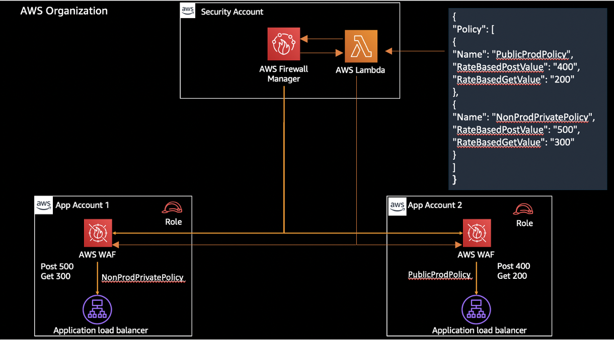
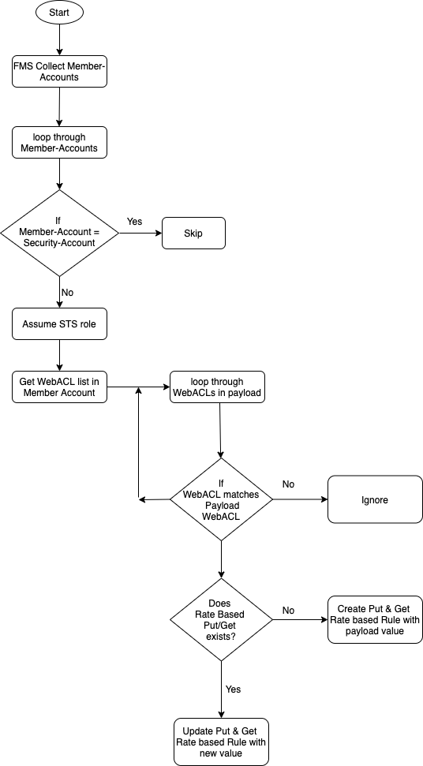

# **Manage rate based rules in WebACL governed by Firewall Manager**

## **Summary**

AWS Firewall Manager is a security management service which allows you to centrally configure and manage firewall rules across your accounts and applications in AWS Organizations. AWS Firewall manager handles deploying WebACL to desired aws accounts within AWS organization, but it doesn't manage rate-based rules.

A rate-based rule tracks the rate of requests for each originating IP address, and triggers the rule action on IPs with rates that go over a limit. So customers with multi-account organization setup will have to manually configure rate-based rules within each WebACL across various accounts, and manually update rate-based rule values on the fly across each WebACL across multiple accounts.

This solution offers flexibility for Security Administrators to configure/modify rate-based rule within WebACL across multiple accounts. Administrators must create json payload with information such as AWS Firewall manager Policy name, Post rate limit, Get rate limit which when passed on to lambda function helps either to create rate-based rule (if rule is not present) else modify existing rules.

## **Prerequisites and limitations**

### Prerequisites

    Active AWS Organization setup
    Active AWS firewall manager
    AWS CLI

### Limitations

    a) Solution works only for WebACLS governed by AWS Firewall Manager
    b) Number of accounts managed by AWS Firewall Manager is less than 100.
    c) Solution works only for "REGIONAL" resources managed by AWS Firewall Manager and not "GLOBAL" resources
    d) "POSTRule" will be the rule name for Post requests and "GetHeadRule" will be the rule name for Get requests.

## **Architecture**

### **Target technology stack**

    AWS WAFV2
    AWS Friewall Manager
    AWS Lambda
    AWS CloudFormation
    AWS IAM Roles
    Python

### **Application Architecture**

## **Lambda flow chart**

## **Epics**

### **Deploy solution in security account

Step 1: Login to Security Account

Step 2: Deploy "RoleforAppAccounts.yml" as cloudformation stack set across desired Organization ID/Organization Units.

Note: Supply Security account id in ParameterValue section

    Command: 
    
    a) cd Deployment
            
    b) Create Stack Set
    aws cloudformation create-stack-set --stack-set-name wafv2-ratebasedrule-setrole --template-body file://RoleforAppAccounts.yml --description "Deploy roles to allow security account access" --parameters ParameterKey=SecurityAccountId,ParameterValue=<xxxxx> --capabilities CAPABILITY_NAMED_IAM --permission-model SERVICE_MANAGED --auto-deployment Enabled=true,RetainStacksOnAccountRemoval=false

Note: Supply Organization unit id

    c) Create Stack Instances
    aws cloudformation create-stack-instances --stack-set-name wafv2-ratebasedrule-setrole --deployment-targets OrganizationalUnitIds=<ou-xxxx> --regions us-east-1 --operation-preferences FailureToleranceCount=0

Step 3: Deploy "WAF-RateRule-Reload-Automation.yml" in security account itself

Note: Upload lambda zip code in S3 bucket and supply the bucket name in below ParameterValue section.

    Command:
    a) cd  Deployment
    
    b) aws cloudformation create-stack --stack-name waf-raterule-reload --template-body file://WAF-RateRule-Reload-Automation.yml --parameters ParameterKey=lambdas3bucket,ParameterValue=<xxxxx> --on-failure ROLLBACK --capabilities CAPABILITY_NAMED_IAM

Step 4: Access lambda services, open "WAF-Config_RateRule_reload" and create an Test Event using payload.json template provided in solution.

Customers can also integrate their SaaS solution with AWS event bridge to create a custom event bus which can input event stream to lambda for changes to rate based rules.
